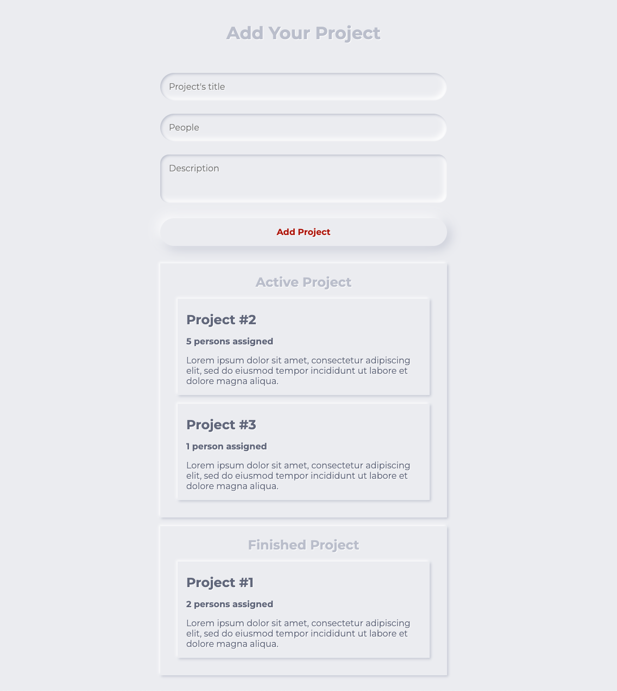

# Drag & Drop Project

HTML, CSS & TypeScript project

[HTML Drag and Drop API | MDN](https://developer.mozilla.org/en-US/docs/Web/API/HTML_Drag_and_Drop_API)

In order to start...

```bash
# first terminal
> npm start
```

```bash
# second terminal
tsc -w
```

